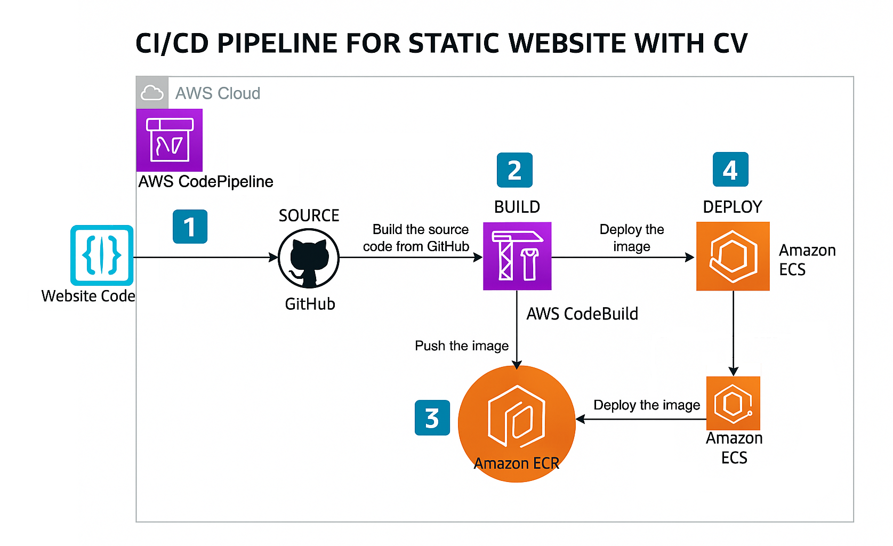
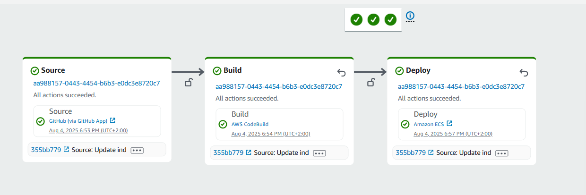
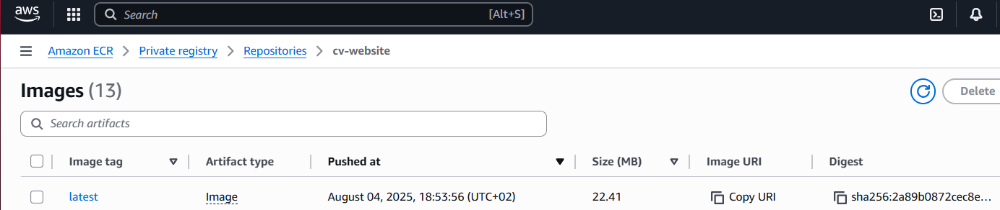
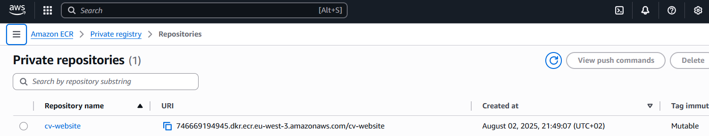
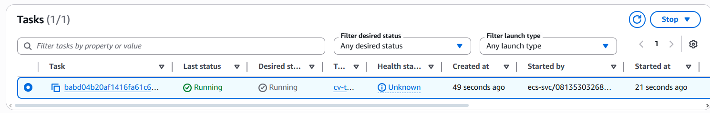
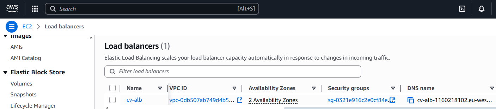

# 🌐 CV Website – Automatyczne wdrażanie (CI/CD) na AWS z Dockerem i ECS Fargate

Ten projekt przedstawia sposób automatycznego wdrażania statycznej strony internetowej (CV) za pomocą kontenera Docker, usług AWS (CodePipeline, ECR, ECS Fargate) oraz publicznego Load Balancera. Po każdej zmianie w repozytorium GitHub uruchamiany jest pipeline, który buduje nowy obraz i wdraża stronę bez potrzeby ręcznej ingerencji.

---

## 🖼️ Podgląd projektu

### 📄 Widok gotowej strony:

---

## 🧭 Architektura rozwiązania

Poniższy diagram przedstawia ogólną architekturę infrastruktury:

- Kontener Docker uruchamiany jest na **ECS Fargate**
- Użytkownicy uzyskują dostęp przez **Application Load Balancer**
- Obrazy przechowywane są w **Amazon ECR**
- Pipeline CI/CD automatycznie aktualizuje wersję

---

## 🔄 Przepływ procesu CI/CD

To schemat pokazujący pełen cykl automatycznego wdrażania:

1. Kod strony znajduje się w repozytorium GitHub.
2. AWS CodePipeline wykrywa zmianę i inicjuje proces.
3. AWS CodeBuild buduje obraz Dockera i wysyła go do ECR.
4. ECS Fargate uruchamia zaktualizowany kontener.
5. Strona staje się dostępna przez Load Balancer.

---

## 🚀 Główne funkcjonalności

- Hostowanie statycznej strony w kontenerze Docker
- Automatyczne CI/CD z użyciem CodePipeline + CodeBuild
- Przechowywanie obrazów w Amazon ECR
- Deployment na ECS Fargate (bez zarządzania serwerami)
- Publiczny dostęp przez Application Load Balancer (ALB)

---

## 🛠️ Technologie

- **Docker**
- **Amazon ECS (Fargate)**
- **Amazon ECR**
- **AWS CodePipeline**
- **AWS CodeBuild**
- **Application Load Balancer (ALB)**

---

## 📸 Screeny z AWS

### ✅ Widok pipeline CodePipeline:

---

### 🏗️ Historia buildów – CodeBuild:

---

### 📦 Obraz Dockera w Amazon ECR:

---

### 🚢 Zadanie uruchomione w ECS Fargate:

---

### ⚙️ Usługa ECS:

---

### 🌐 Load Balancer (ALB):

---

## 📂 Struktura projektu

📁 Pipeline-for-static-website-with-CV/     # Główny folder repozytorium
├── 📁 screenshots/                         # Zrzuty ekranu użyte w README
│   ├── website-preview.png                # Widok końcowej strony
│   ├── model.png                          # Schemat architektury infrastruktury
│   ├── diagram-ci-cd.png                  # Diagram przedstawiający pipeline CI/CD
│   ├── codepipeline.png                   # Screen z AWS CodePipeline
│   ├── codebuild-history.png              # Historia buildów CodeBuild
│   ├── ecr-images.png                     # Lista obrazów w ECR
│   ├── ecr-repo.png                       # Widok repozytorium ECR
│   ├── ecs-task.png                       # Informacja o uruchomionym tasku ECS
│   ├── ecs-service.png                    # Status działającej usługi ECS
│   └── alb.png                            # Informacje o Load Balancerze

├── Dockerfile                             # Plik budujący obraz Dockera
├── buildspec.yml                          # Konfiguracja AWS CodeBuild
├── index.html                             # Plik HTML Twojej strony CV
├── style.css                              # Styl strony
└── README.md                              # Dokumentacja projektu
