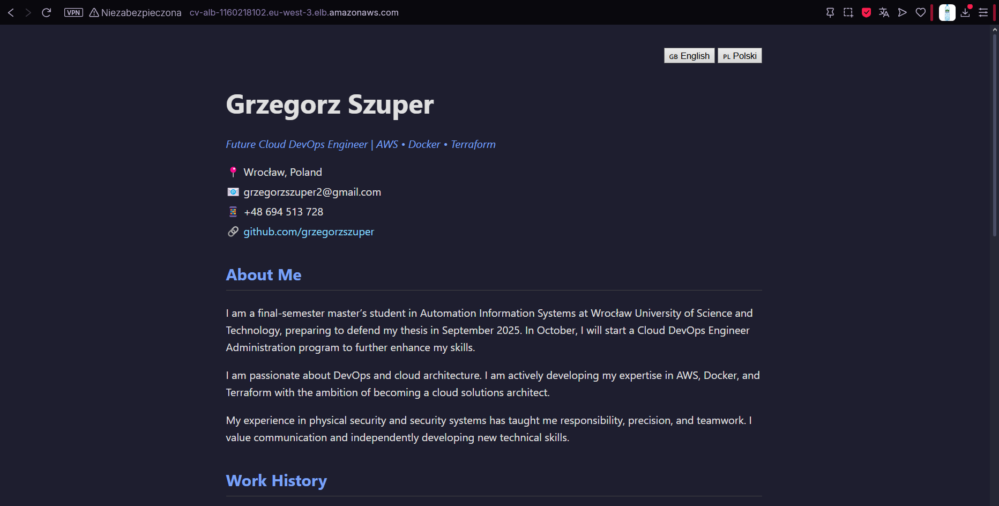
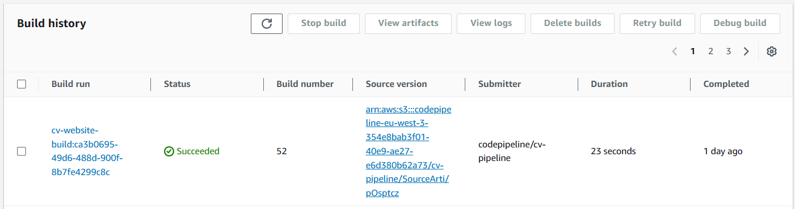

# 🌐 CV Website – Automatyczne wdrażanie (CI/CD) na AWS z Dockerem i ECS Fargate

Ten projekt pokazuje, jak automatycznie wdrożyć statyczną stronę internetową (CV) za pomocą kontenera Docker, AWS CodePipeline, ECR oraz ECS Fargate. Dzięki temu każda zmiana w kodzie powoduje automatyczne zbudowanie i wdrożenie nowej wersji strony.

---

## 🖼️ Podgląd projektu

### 📄 Widok gotowej strony:

---

## 🚀 Główne funkcjonalności

- Hostowanie statycznej strony w kontenerze Docker
- CI/CD zbudowane na CodePipeline + CodeBuild
- Automatyczne budowanie i publikacja do ECR
- Uruchamianie kontenera na ECS Fargate
- Publiczny dostęp przez Application Load Balancer (ALB)
- Pełna automatyzacja – brak ręcznego logowania do AWS

---

## 🛠️ Technologie

- **Docker**
- **Amazon ECS (Fargate)**
- **Amazon ECR**
- **AWS CodePipeline / CodeBuild**
- **AWS ALB**

---

## ⚙️ Jak działa pipeline

1. Zmiana w repozytorium (GitHub push)
2. CodePipeline wykrywa zmianę
3. CodeBuild buduje obraz Dockera i publikuje go do ECR
4. ECS uruchamia zaktualizowany kontener
5. Strona jest dostępna publicznie

---

## 🔄 Etapy wdrożenia

### ✅ CodePipeline: Source → Build → Deploy

---

### 🏗️ Historia buildów – CodeBuild:

---

### 📦 Obraz Dockera w ECR:

---

### 🚢 Zadanie ECS:

---

### ⚙️ Usługa ECS:

---

### 🌐 Load Balancer (ALB):

---

